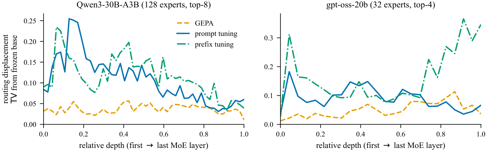

# Not All Drift Is a Mechanism: Tracing Prompt Adaptation in LLMs

  

Code for the paper. We compare three ways of adapting a frozen language model
through its context: discrete prompt optimization with GEPA, prompt tuning and
prefix tuning. The comparison runs on a dense model (Gemma 2 2B-IT) and on two
mixture-of-experts models (Qwen3-30B-A3B-Instruct-2507 and gpt-oss-20b), all on
five-label Civil Comments.

## TL;DR

Where an adaptation enters the model predicts how task information reaches the
output. Optimized text mostly changes how the answer is constructed, input-level
prompts write into content representations, and layer-wise prefixes keep direct
control through attention. Common representation measurements react just as
strongly to matched placebos, so internal drift on its own is not evidence of a
mechanism. In MoE models the same differences show up as distinct routing
patterns, and a handful of rarely used experts decide whether an adapted model
survives pruning.

The figure above shows the routing displacement (total variation from the
frozen base) of the comment tokens that every arm shares. GEPA moves a few
percent of the routing mass at every depth, the continuous methods move several
times more.

## Key findings

- **Score gains hide different mechanisms.** With order-lenient parsing most of
  GEPA's gain over the seed prompt disappears, while prompt and prefix tuning
  keep theirs. The seed computation already carries most of the label
  information.
- **Representation drift is not specific to the task.** A length-matched padding
  prompt changes residual geometry and lowers the score, so distance from the
  seed prompt does not track adaptation quality. Adapted and padded contexts
  also share the same shift structure.
- **Per-example state differences carry the adapted output.** A matched late-layer
  state difference transfers most of the adapted behaviour, a dataset-mean shift
  does not, and learned affine corrections recover much of it in free generation.
- **Only continuous adaptation reroutes the shared tokens.** In MoE models the
  load changes mainly through the tokens a method adds or removes, not through
  rerouting.
- **Expert load does not tell whether an expert is needed.** Frequency pruning
  removes rarely used super experts, and whether an adapted model still depends
  on them is set by the adaptation method.

## Repository

The two halves of the paper live in separate folders. Each has its own
environments, because the dense and MoE experiments pin different versions of
Transformers and PEFT.

| Folder | What's inside |
|---|---|
| [`dense/`](dense/README.md) | Dense-model experiments on Gemma 2 2B-IT: GEPA, prompt and prefix tuning, probes, tuned lens, steering, attention masking, shift geometry, SAE transfer, learned corrections and early exits |
| [`dense/continuous/`](dense/continuous/README.md) | Prompt and prefix tuning and the analyses that read PEFT internals or Gemma Scope features |
| [`dense/discrete/`](dense/discrete/README.md) | Civil Comments splits, GEPA, and the shared condition registry for GEPA, prompt and prefix runs |
| [`moe/`](moe/README.md) | MoE experiments on Qwen3-30B-A3B and gpt-oss-20b |
| [`moe/adaptation/`](moe/adaptation/README.md) | GEPA, prompt tuning and prefix tuning on the MoE backbones, checkpoint selection on validation |
| [`moe/pruning/`](moe/pruning/README.md) | Routing maps, load statistics and frequency pruning |
| [`moe/super-experts/`](moe/super-experts/README.md) | Super-expert identification, magnitudes, pruning, attention sinks, router retraining and expert-parallel timing |
| [`moe/figures/`](moe/figures/README.md) | Scripts for the MoE figures |

The repository contains code and configuration only. Datasets, model weights,
adapters, optimized prompts and run outputs are produced by the scripts and are
not tracked.

## License

[MIT](LICENSE). The Civil Comments data and the model checkpoints keep their own licenses.
